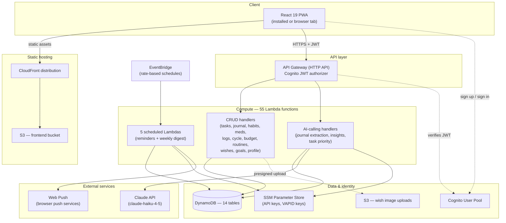

# LifeOs Architecture

🌸 System design reference

A personal life-tracking PWA — tasks, journal, habits, medications, cycle,
budget, routines, wishes, and AI-generated insights — built as a serverless
AWS backend behind a React SPA. This document describes the system as it is
actually deployed today, not an aspirational target.

account 593110023904
region ap-southeast-2
stack lifeos-backend-dev
~3 active users

## Overview

LifeOs consolidates the trackers a person would otherwise scatter across five
apps — a to-do app, a journal, a habit tracker, a period tracker, a budget
app — into one account, with a single point of entry: **write a
sentence in Journal, and Claude fills in the rest.** Say "walked 10km,
drank a bottle of water, called mom for 20 minutes" and steps, water, and a
call log all populate on their own — nothing about the system's structure is
exposed to the person using it.

It is built and run for a small number of real users (currently three — the
author and two others), not for scale. Every architectural choice in this
document should be read against that fact: DynamoDB on-demand billing, no
caching layer beyond a 4-second in-memory GET cache, a single non-prod-named
deployment stage. Where a more scalable pattern was considered and
deliberately not built, it's called out in [§14](#limitations)
rather than left unexplained.

- **55** Lambda functions
- **50** API routes
- **14** DynamoDB tables
- **18** Frontend routes
- **5** Scheduled jobs
- **1** AI model (Haiku 4.5)

## Architecture at a glance

Everything is serverless. There is no server process running continuously
anywhere in the system — the frontend is static files on S3 behind
CloudFront, and every unit of backend logic is a Lambda invocation triggered
by either an API Gateway request or an EventBridge schedule.



Request/data flow — solid lines are synchronous calls, dotted are auth/config lookups.

Two request paths matter for understanding latency and cost: the
**CRUD path** (read/write one or two DynamoDB items, usually
under 300ms) and the **AI path** (journal save, insights
generation, task priority — each makes one Claude API call, so these
Lambdas run with longer timeouts, see [§4](#backend)).

## Frontend

`react 19.2` · `typescript 6.0` · `tailwindcss 4.3` · `vite 8.1` · `react-router-dom 7.18` · `vite-plugin-pwa 1.3` · `aws-amplify 6.18`

### Routing & code splitting

Three auth-flow pages (Sign up, Confirm sign up, Log in) are imported
eagerly, since they're the first thing an unauthenticated visitor needs.
Every page behind the authenticated shell — Dashboard, Tasks, Journal,
Medications, Logs, Cycle, Budget, Routines, Insights, Calendar, Wishes,
Settings, Help, Onboarding — is `React.lazy()`-loaded, one chunk
per page, inside a single `<Suspense>` boundary at the
router root. A visitor to any one page downloads only that page's JS, not
the other twelve.

### Data layer — `useApi()`

A single hook wraps every network call. It injects the Cognito bearer token
per request, retries up to twice on HTTP 503 (confirmed via CloudWatch to be
exclusively Lambda cold-start throttling, never a partially-executed
request, so it's always safe to retry), and layers a short-lived cache on
top of `GET` requests only:

- **In-flight dedup** — if two components request the same
  path in the same tick (e.g. four separate components each reading
  `GET /profile` on mount), they share one network request.
- **4-second response cache** — a repeat `GET` to
  the same path within 4 seconds returns the cached response instead of
  hitting the network again.
- **Write-triggered invalidation** — any successful
  non-`GET` request clears the entire cache. This was tightened
  after a real bug surfaced during testing: a component reading a cached
  `GET /profile` shortly after a different component's
  `PATCH /profile` returned stale data. Clearing the whole cache
  on any write is simpler and safer than trying to compute which paths a
  given write could affect.

```
// frontend/src/api/useApi.ts — shape, not full source
const GET_CACHE_TTL_MS = 4000;
const inFlightGetRequests = new Map<string, Promise<unknown>>();
const recentGetResponses = new Map<string, { data: unknown; timestamp: number }>();
// GET: check cache -> check in-flight -> fetch & cache
// non-GET: fetch, then recentGetResponses.clear() on success
```

### Design system — "Ink & Bloom"

A shared token file (`components/ui.ts`) exports plain
className strings — `card`, `primaryButton`,
`pillButton`, `input`, `errorText` — that
every page composes rather than writing one-off Tailwind classes. The
palette is a coral accent (`bloom`) on warm paper/near-black
ink surfaces, with light and dark variants for every token defined in CSS
custom properties. Two small shared components, `Skeleton` and
`EmptyState`, standardize loading and zero-data states across
every list page.

### PWA & push

`vite-plugin-pwa` in `injectManifest` mode ships a
custom service worker, making the app installable to a home screen. Web
push subscriptions are created client-side and stored server-side
(`PushSubscriptionsTable`), which the five scheduled Lambdas
read to deliver reminders — see [§8](#notifications).

## Backend compute

Defined as a single AWS SAM template. All 55 functions share a
`Globals` block — Node.js 20.x on arm64, 256MB memory, X-Ray
tracing on, 10-second default timeout — and individual functions override
the timeout upward where they call Claude (30–120s depending on how much
context the prompt assembles).

> **Tuning note**
>
> Memory was raised from Lambda's 128MB default to 256MB across the board.
> Lambda allocates CPU proportionally to memory, so this reduces cold-start
> and execution time enough that total GB-seconds billed stays roughly flat —
> it wasn't a cost tradeoff, just an under-provisioned default being fixed.

### IAM shape

Every function gets scoped, least-privilege policies — a
`DynamoDBReadPolicy` or `DynamoDBCrudPolicy` per table
it actually touches, never a wildcard. A function that both creates journal
entries and needs to read the user's height for step-distance conversion
(see [§7](#ai)) has an explicit read policy on
`UserProfileTable` in addition to its own table's CRUD policy —
nothing is implicitly reachable.

### Function shapes

| Shape | Count | Timeout | Example |
| --- | --- | --- | --- |
| Simple CRUD (single table) | ~35 | 10s | updateHabit, deleteWish |
| Multi-table read/aggregate | ~10 | 10–30s | getSchedule, listWishes |
| Claude-calling | ~5 | 30–120s | createJournalEntry, getInsights, updateTask |
| Scheduled (EventBridge) | 5 | 10–60s | weeklyInsightsScheduler |

## Data model

14 DynamoDB tables, all `PAY_PER_REQUEST` billing, all with
server-side encryption and point-in-time recovery enabled. Every table uses
the same partition strategy — `userId` as the hash key — which
is what makes the per-user ownership model in [§6](#auth)
structurally enforceable rather than just convention. There are
**zero** Global Secondary Indexes anywhere in the schema; every
table is queried by its own primary key only.

| Table | Partition key | Sort key | Notes |
| --- | --- | --- | --- |
| TasksTable | userId | taskId | dueAtUtc computed client-side for reminder scheduling |
| JournalEntriesTable | userId | date | one entry per calendar day, enforced by conditional put |
| HabitLogsTable | userId | dateHabitType | composite sort key, e.g. 2026-08-21#water |
| MedicationsTable | userId | medicationId | – |
| MedicationLogsTable | userId | dateMedicationId | composite sort key |
| LogEntriesTable | userId | logId | catch-all: food, calls, weight, mood, sleep, cycle events |
| RoutineTemplatesTable | userId | routineId | – |
| RoutineLogsTable | userId | dateRoutineStep | composite sort key |
| GoalsTable | userId | metric | one row per tracked target (water, exercise, steps, weight) |
| WishesTable | userId | wishId | 5 progress-tracking modes, see §9 |
| ExpensesTable | userId | expenseId | – |
| BudgetsTable | userId | category | per-category recurring monthly limits |
| PushSubscriptionsTable | userId | endpoint | self-pruned on 404/410 from the push service |
| UserProfileTable | userId | — (no sort key) | sex, height, weight target, monthly budget, onboarding flag |

The composite sort-key pattern (`dateHabitType`,
`dateMedicationId`, `dateRoutineStep`) lets a single
`Query` with a `BETWEEN` condition fetch an entire
date range for one habit/medication/routine without a table scan or a GSI —
this is deliberate schema design, not an accident.

> **Deliberately deferred — §14 has the full reasoning**
>
> `LogEntriesTable` is queried by `userId` only
> (its sort key, `logId`, is a random UUID with no date
> ordering), so date-range reads filter after the fact rather than at the
> key-condition level. Fixing this properly means changing the sort key to a
> date-prefixed composite — DynamoDB can't do that in place, it needs a
> parallel table and a migration. At current data volume this costs
> fractions of a cent; it's tracked, not ignored.

## Auth & identity

A single Cognito User Pool, email as the username, standard password policy
(8+ characters, upper/lower/number required). The frontend uses AWS
Amplify's Auth module to sign up, confirm, and sign in; API Gateway's HTTP
API validates the resulting JWT on every request via a Cognito JWT
authorizer — no custom token-verification code exists anywhere in the
Lambda layer.

### The ownership guarantee

Every handler resolves the calling user's ID the same way, through one
shared function:

```
// backend/src/common/auth.ts
export function getUserId(event) {
  return event.requestContext.authorizer.jwt.claims.sub;
}
```

`sub` is read from the *verified* JWT claims that API
Gateway itself attaches after checking the token's signature — never from a
client-supplied body field or query parameter. Combined with every
DynamoDB table using `userId` as its partition key, this makes
cross-user data access a structural non-issue rather than something each
handler has to remember to check: a query for someone else's data isn't
just rejected, the key it would need doesn't exist in the request path to
begin with.

## AI integration

One model for everything: `claude-haiku-4-5`, called
via the Anthropic SDK's structured-output helper
(`zodOutputFormat`) so every response is validated against a Zod
schema before the handler trusts it. The API key lives in SSM Parameter
Store, fetched once per cold start and cached for the life of the execution
environment.

### 1. Journal extraction

The core interaction: free-text journal entry in, structured writes to
eight other tables out. The extraction schema covers water, exercise,
steps, distance, food + meal type, sleep times, weight, mood (1–5),
medications taken (matched against the user's actual active medication
names — never invented), routine steps completed, cycle events, calls, and
expenses. A hard rule in the system prompt: manually-entered values are
never overwritten by what the model extracted.

Two unit-conversion decisions worth documenting because they were tuned
after real usage:

- **Water units** — "a glass" converts to 250ml, "a bottle"
  to 500ml. Both are explicit in the prompt now; before the bottle case was
  added, the model was silently guessing (and guessing low — 250ml for a
  bottle).
- **Distance → steps** — the model reports raw distance
  (`distanceKm`) rather than estimating a step count itself,
  because LLM arithmetic isn't reliable enough to trust for a number that
  gets written to a habit log. The handler computes the actual figure:
  `steps = distanceKm × 1000 / (heightCm × 0.415 / 100)`,
  reading the user's height from `UserProfileTable` (falling
  back to a 170cm average if the user hasn't set one). An explicit step
  count in the text (e.g. "walked 8000 steps") always wins and skips this
  calculation entirely.

### 2. Insights

On-demand (Today / This week) and automatic — a scheduled Lambda sends each
user a push notification roughly once every 7 days, gated by a
`lastWeeklyDigestSentAt` timestamp on their profile rather than
a fixed calendar day, so it's self-correcting regardless of what day the
scheduler happens to run relative to when someone signed up.

### 3. Task priority suggestion

Reads a task's title, description, due date, and time estimate together to
suggest Low/Medium/High. Turns itself off the moment a person picks a
priority manually — that's a deliberate override, and the AI shouldn't
second-guess it on the next edit. A separate, non-AI guardrail forces
High automatically when the remaining time before the deadline can't fit
the stated estimate, so a badly-worded task still gets flagged correctly
even if the model's read of the text is wrong.

## Notifications & scheduled jobs

Five EventBridge-triggered Lambdas, each on its own cadence, each sending
Web Push notifications through a shared `sendPushNotification()`
helper (VAPID keys in SSM). A subscription that a push service reports as
gone (HTTP 404/410 — the browser unsubscribed, or the device is gone) is
deleted automatically rather than retried forever.

| Scheduler | Cadence | Purpose |
| --- | --- | --- |
| taskReminderScheduler | rate(15 min) | Notifies once when a task's due instant falls inside the current 15-minute window |
| wishReminderScheduler | rate(15 min) | Deadline-approaching countdown + a one-time "falling behind schedule" nudge |
| medicationReminderScheduler | rate(15 min) | Fires at each medication's configured time of day, reconstructed from a stored timezone offset |
| cycleReminderScheduler | rate(6 hours) | Predicted-period-approaching notice, sent once per predicted date |
| weeklyInsightsScheduler | rate(1 day) | Checks each user's digest gate daily; generates & sends only when 7 days have actually elapsed |

All five share one paginated scan helper for
`PushSubscriptionsTable` rather than each hand-rolling its own —
this was a fix applied after an audit found none of them handled
DynamoDB's `LastEvaluatedKey` pagination, meaning results would
have silently truncated once the table's scan response exceeded 1MB. At
current table size that ceiling was nowhere close, but it was a latent
correctness bug worth closing regardless of scale.

## API surface

50 routes on a single HTTP API, grouped by resource below. Every route
(except the auth endpoints Cognito itself fronts) requires a valid JWT.

| Resource | Routes |
| --- | --- |
| Identity | GET /whoami · GET/PATCH /profile · DELETE /account |
| Tasks | GET/POST /tasks · PATCH /tasks/{id} · GET /schedule/{date} |
| Journal | GET/POST /journal · PATCH /journal/{date} |
| Habits | GET /habits · GET /habits/{date} · PATCH /habits/{date}/{type} |
| Goals | GET /goals · PATCH /goals/{metric} |
| Medications | GET/POST /medications · DELETE /medications/{id} · GET /medication-logs(/{date}) · PATCH /medication-logs/{date}/{medicationId} |
| Logs | GET/POST /logs · PATCH/DELETE /logs/{id} |
| Routines | GET/POST /routines · PATCH/DELETE /routines/{id} · GET /routine-logs(/{date}) · PATCH /routine-logs/{date}/{routineId}/{stepIndex} |
| Budget | GET /budgets · PUT/DELETE /budgets/{category} · GET/POST /expenses · PATCH/DELETE /expenses/{id} |
| Wishes | GET/POST /wishes · PATCH/DELETE /wishes/{id} · image routes under /wishes/{id}/images\* |
| Insights | GET /insights |
| Push | POST/DELETE /push-subscriptions |

## Performance

A dedicated pass audited both ends of the stack and shipped the concrete
fixes below — framed here as the current state, not a roadmap.

#### Frontend

- Route-based code splitting ([§3](#frontend)) — each page
  ships its own JS chunk.
- `useApi` request dedup + 4s cache collapsed the Dashboard's
  duplicate calls: `GET /profile` went from 4 independent
  fetches (Layout, OnboardingGate, BudgetPreview, CyclePreview all reading
  it on mount) down to 1; `/goals` and `/tasks` each
  went from 2 down to 1.
- Skeleton loading states replaced bare "Loading…" text across every
  list page and the Dashboard's nine independently-loading sections.

#### Backend

- Lambda memory 128MB → 256MB across all 55 functions
  ([§4](#backend)).
- `listWishes` had an N+1 pattern — one extra
  `HabitLogsTable` query per habit-linked wish. Rewritten to one
  combined query covering every habit-linked wish's date range, with
  per-wish progress computed in memory from that single result set.
- Reminder-scheduler scan pagination ([§8](#notifications)).
- Wish gallery images now load with `loading="lazy"`.

## Security

- **Encryption at rest** — every DynamoDB table has
  `SSESpecification` enabled.
- **Encryption in transit** — CloudFront and API Gateway
  both terminate HTTPS only.
- **Identity** — Cognito-issued, signature-verified JWTs;
  see [§6](#auth) for the ownership guarantee this enables.
- **Recovery** — point-in-time recovery enabled on every
  table, so an accidental delete or bad write is recoverable to any second
  in the last 35 days.
- **Secrets** — the Anthropic API key and Web Push VAPID
  private key both live in SSM Parameter Store, never in source or
  environment files, fetched at cold start with
  `SSMParameterReadPolicy` scoped to the exact parameter name.

## Deployment

The whole backend is one AWS SAM template
(`lifeos-backend-dev`), deployed with
`sam build && sam deploy`. The frontend is a static
Vite build synced to S3 with `aws s3 sync --delete`, followed by
a full CloudFront invalidation (`/*`) so changes are visible
immediately rather than waiting out cache TTLs.

There is currently one environment — `dev` — serving real
traffic for all three users; there is no separate staging or production
stage. This is a conscious tradeoff for a 3-person personal tool, not an
oversight, but it does mean every deploy goes straight to the only
environment that exists.

## Cost model

At 3 active users, the dominant cost is Claude API usage (journal
extraction runs on every save; insights and task-priority calls are
lighter and less frequent) — Haiku 4.5 pricing is $1.00 / 1M input tokens,
$5.00 / 1M output tokens. AWS costs (Lambda invocations, DynamoDB
on-demand, API Gateway requests, S3 + CloudFront) sit well inside typical
free-tier or near-free ranges at this scale. This is an estimate based on
usage patterns discussed during development, not a pull from AWS Cost
Explorer — treat it as directional, not a bill.

## Known limitations — deliberately deferred

Every item below was identified, understood, and consciously not built —
the common thread is that each would add real engineering risk or
maintenance surface for a benefit that doesn't show up at 3 users.

> **LogEntriesTable sort key**
>
> Queried by `userId` only; date-range reads filter
> post-query rather than at the key-condition level (see
> [§5](#data-model)). The correct fix — a date-prefixed sort key
> — needs a parallel table and a data migration, since DynamoDB can't
> change a table's key schema in place.

> **Five independent reminder scans**
>
> The five schedulers in §8 each scan `PushSubscriptionsTable`
> on their own cadence (293 scans/day combined at current rates) rather than
> one shared scan feeding all five. Consolidating them into a single
> Lambda would cut that to ~96 scans/day, but merges five independently
> working, independently testable functions into one — real regression
> risk for a table that currently holds a handful of items and costs
> fractions of a cent to scan that often.

> **No TTL / archival**
>
> `LogEntriesTable` and similar high-write tables have no
> TTL configured, so they grow unbounded. Not a problem yet at this data
> volume; worth revisiting alongside the sort-key fix above if usage grows
> substantially.

> **Single environment**
>
> No staging stage exists (§12) — every deploy targets the only
> environment serving real users. Acceptable at this scale with the
> established verification pipeline (typecheck, build, disposable
> test-user smoke test, then deploy), but it is a real gap that would need
> addressing before this could safely serve more people or more
> contributors.

LifeOs system design reference — reflects the deployed state of
lifeos-backend-dev as of this document's
publication. Update alongside significant architecture changes rather than
letting it drift.
