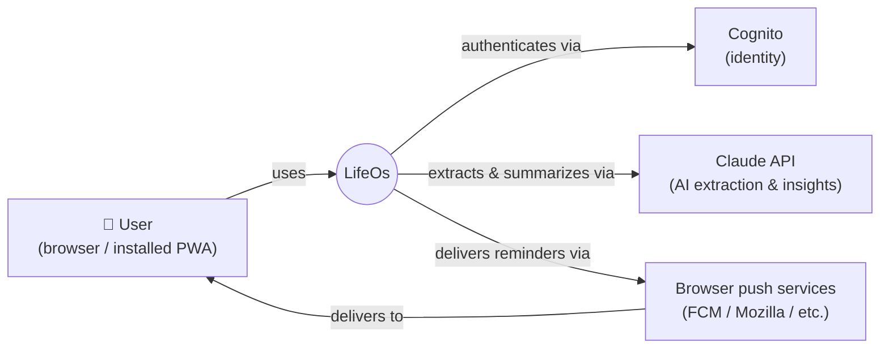
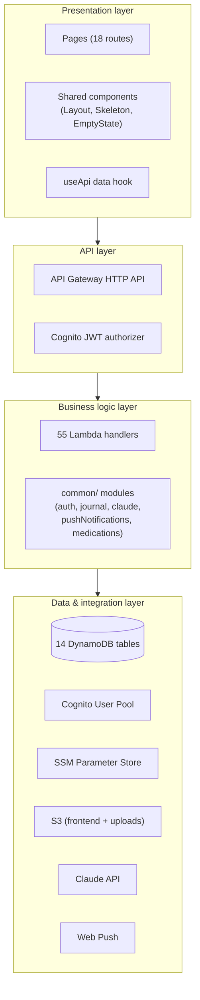
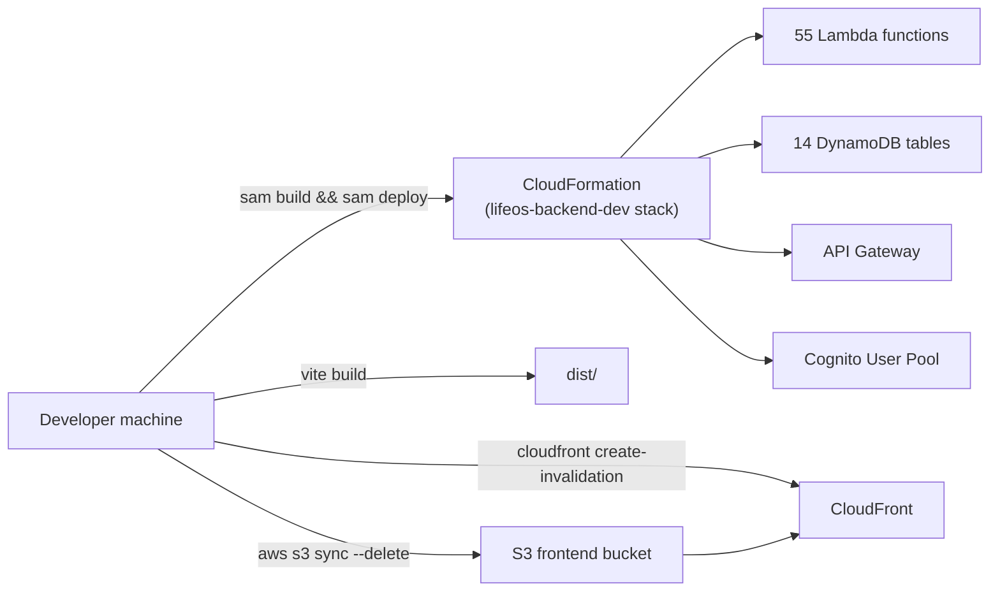
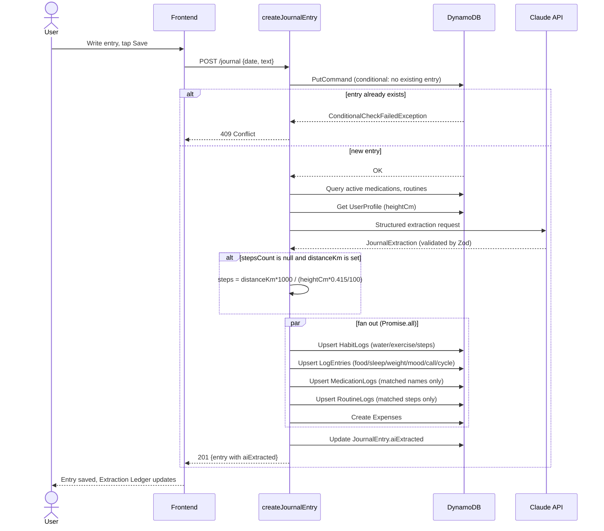
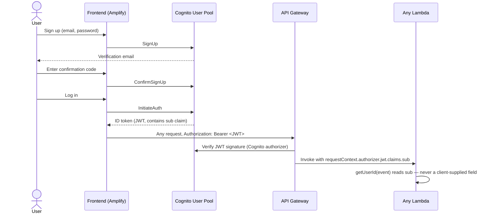
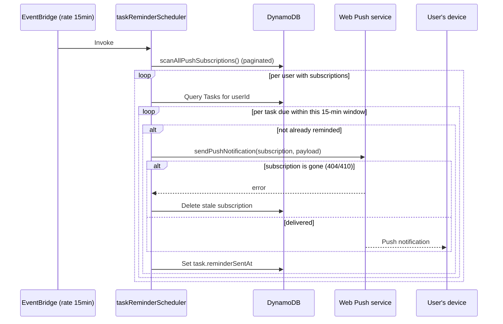

# LifeOs HLD & LLD

📐 Design specification

High-level and low-level design documentation for LifeOs, a serverless
personal life-tracking system on AWS. Part I covers requirements,
architecture, and capacity at the system level; Part II drills into
schemas, contracts, sequence flows, and the exact algorithms running in
production.

v1.0
stack lifeos-backend-dev
region ap-southeast-2
companion doc: LifeOs Architecture

Part I

## High-Level Design

What the system does, for whom, under what constraints, and how its major pieces fit together — the level a new engineer or a reviewer reads before touching any code.

## Introduction & scope

LifeOs is a single-account personal tracking system spanning tasks,
journaling, habits, medications, menstrual cycle tracking, budgeting,
routines, goals ("wishes"), and AI-generated insights. Its defining
design bet is that **free-text journal entries are the primary
input surface** — an LLM extracts structured data from what a
person naturally writes and fans it out to the specialized trackers,
rather than requiring separate manual entry into each one.

This document specifies the system as built and deployed, for the
purpose of enabling: (a) a new contributor to understand the system
without reading all 55 Lambda functions, (b) a design review to evaluate
the choices made and the tradeoffs deliberately accepted, and (c) future
extension work to be scoped against an accurate baseline.

## Goals & non-goals

### Goals

- One account, one mental model, for everything a person tracks daily.
- Minimize manual data entry — a journal sentence should be enough for most days.
- Every feature works fully offline-tolerant as a PWA and installs like a native app.
- Strict per-user data isolation with no possibility of cross-account leakage.
- Low operating cost at small scale — pay-per-use infrastructure throughout, no idle compute.

### Non-goals

- **Not multi-tenant SaaS.** Built and operated for a small, known set of real users (currently three), not designed to onboard the public.
- **Not high-availability critical infrastructure.** No multi-region failover, no staging environment (see [§10](#deploy-view)).
- **Not a medical device.** Cycle phase prediction and health estimates are explicitly labeled as estimates from the user's own logged averages, never medical advice.
- **Not real-time collaborative.** Single-user-per-account; no sharing, no multi-user households.

## Functional requirements

| Module | Core requirement |
| --- | --- |
| Journal | One entry per calendar day; free text plus optional voice input; AI extraction into 8 downstream trackers without overwriting manually-entered values. |
| Tasks | CRUD with due date/time, effort estimate, and priority; AI priority suggestion with a deterministic deadline-forces-High guardrail; push reminders; calendar month view. |
| Habits | Daily water/exercise/steps tracking, manual or AI-journal-sourced, with per-metric daily goals and streaks. |
| Medications | Active-medication tracking with dosage/notes, daily taken/missed logging, adherence percentage, daily push reminders. |
| Logs | Catch-all structured logging for food, calls, sleep, weight, body fat %, mood, and cycle events. |
| Cycle | Period start/end and symptom logging; phase estimation and next-period prediction from logged history; hidden entirely for users who set sex = male. |
| Budget | Per-category recurring monthly limits, expense logging, month-over-month spend tracking against an overall monthly budget. |
| Routines | Multi-step daily checklists (e.g. skincare) with per-step done/skipped state and consecutive-day streaks. |
| Wishes | Goal tracking across 5 progress modes (percentage, milestone, habit-linked, time-based, quantity) with deadline and falling-behind push reminders. |
| Insights | On-demand AI summary (today/week) plus an automatic weekly digest push, gated to roughly once every 7 days per user. |
| Onboarding & Settings | First-run setup of sex, height, and daily targets; theme, data export, account deletion. |

## Non-functional requirements

| Attribute | Target / current posture | How it's achieved |
| --- | --- | --- |
| Availability | Best-effort, managed-service SLA (no custom uptime target) | Fully managed AWS services (Lambda, DynamoDB, API Gateway, Cognito, CloudFront) — no self-managed servers to keep running |
| Security & isolation | Zero cross-user data access | JWT-derived `userId` as every table's partition key (§6, LLD §17) |
| Data durability | Point-in-time recovery to any second, 35-day window | `PointInTimeRecoverySpecification` enabled on all 14 tables |
| Confidentiality | Encrypted at rest and in transit | DynamoDB SSE on every table; HTTPS-only at CloudFront and API Gateway |
| Performance | Sub-second CRUD, low seconds for AI calls | 256MB Lambda memory, DynamoDB single-digit-ms reads on key lookups, client-side request cache/dedup (LLD §15) |
| Consistency | Eventually consistent reads accepted; no cross-table transactions used | DynamoDB default (eventually consistent) reads; each write is scoped to one logical entity per table |
| Cost efficiency | Near-zero idle cost | 100% pay-per-invocation/pay-per-request billing — no provisioned capacity anywhere |
| Maintainability | One engineer can reason about the whole system | Shared `common/` modules per concern, one design-token file for the whole frontend, this document |

## System context



System context — LifeOs and its three external dependencies. No other third-party system is integrated.

LifeOs has exactly three external system dependencies: **Cognito**
for identity (fully inside the AWS account, but architecturally external to
the application code), **Claude** for all AI extraction/summarization,
and the **browser push ecosystem** (Web Push standard, routed
through each browser vendor's push service) for notifications. There is no
payment processor, no email service, no analytics/telemetry vendor, and no
third-party wearable integration at this time.

## Component architecture

Four layers, each with a single responsibility:



Layered view. See the companion *LifeOs Architecture* document for the full request-flow diagram.

The business logic layer is intentionally thin per function — each Lambda
handler is a small, single-purpose file that composes shared logic from
`backend/src/common/` (auth resolution, journal extraction
orchestration, Claude client, push delivery, medication date math) rather
than duplicating it. This keeps the 55-function surface area manageable:
most handlers are <80 lines because the real logic lives in a handful
of shared modules (detailed in [§11](#modules)).

## Technology stack & rationale

| Layer | Choice | Why |
| --- | --- | --- |
| Frontend framework | React 19.2 + TypeScript 6.0 | Component reuse across 18 routes; type safety across a 14-table data model shared between frontend and backend |
| Styling | Tailwind CSS 4.3 | Utility classes composed into one shared token file, avoiding a separate component-library dependency |
| Build/dev | Vite 8.1 | Native ESM dev server, fast HMR, first-class code-splitting output |
| PWA | vite-plugin-pwa 1.3 (injectManifest) | Custom service worker needed for Web Push subscription handling beyond generic asset caching |
| Auth client | aws-amplify 6.18 | First-party Cognito client — sign-up/confirm/sign-in/token-refresh without hand-rolling the OAuth/SRP flow |
| Compute | AWS Lambda (Node.js 20.x, arm64) | Zero idle cost at 3-user scale; arm64 (Graviton) for better price/performance than x86 |
| API layer | API Gateway HTTP API | Cheaper and lower-latency than REST API Gateway for a JWT-authorizer-only use case with no need for REST API's extra features |
| Database | DynamoDB, on-demand billing | Every access pattern in the system is a single-item or single-partition-range lookup by `userId` — no relational joins are ever needed, so a key-value store avoids RDS's fixed idle cost |
| Identity | Amazon Cognito | Managed user pool with JWT issuance, avoids building password storage/reset/verification |
| AI | Claude Haiku 4.5 (Anthropic) | Structured-output support (schema-validated JSON) is the actual requirement, not conversational quality — Haiku is the cheapest tier that reliably does structured extraction at the required accuracy |
| Push | web-push (VAPID) | Standards-based, no vendor lock to a push provider (no Firebase/OneSignal dependency) |
| IaC | AWS SAM | Native CloudFormation superset purpose-built for Lambda + API Gateway stacks, no need for a general-purpose IaC tool at this scope |

## Major data flows

Four flows account for nearly all system activity; each is detailed as a sequence diagram in [LLD §14](#sequences):

1. **Journal-driven extraction** — a journal save triggers one Claude call whose structured output fans out into up to 8 tables in parallel.
2. **Direct CRUD** — every other page (Tasks, Medications, Budget, etc.) reads/writes its own table(s) directly, no AI involved.
3. **Scheduled push delivery** — 5 EventBridge-triggered Lambdas scan subscriptions and push-notify on independent cadences.
4. **Auth** — Amplify-mediated sign-up/confirm/sign-in against Cognito, JWT attached to every subsequent API call.

## Capacity estimation

Back-of-envelope, at current scale and at a hypothetical 100-user scale —
useful for confirming the architecture has headroom without needing to
change shape, not as a growth plan (see [§2](#goals) non-goals).

| Metric | At 3 users | At 100 users (illustrative) |
| --- | --- | --- |
| Journal saves/day | ~3 | ~100 |
| Claude calls/day | ~10–15 | ~350–500 |
| Total API requests/day | ~150–300 | ~5,000–10,000 |
| Scheduler invocations/day | 293 (fixed — see below) | 293 (fixed — independent of user count) |
| DynamoDB item count growth/year | low thousands | low hundred-thousands |
| Peak concurrent Lambda executions | 1–2 | ~10–20 |

The scheduler invocation count doesn't scale with users because each of
the 5 scheduled Lambdas fires on a fixed cadence (§ LLD 14) and processes
all users' subscriptions in one invocation — cost there scales with
*Lambda duration* as user count grows, not invocation
*count*. At 100 users the per-invocation scan/loop simply does more
work per run; this is the first place the system would need attention if
it ever grew meaningfully (see the Architecture doc's Known Limitations
section for the specific deferred fix).

## Deployment view



One command per side — no CI/CD pipeline runs these automatically; deploys are triggered manually today.

A single AWS account (593110023904), single region
(ap-southeast-2), single environment (`dev` — see the
Architecture doc's §12/§14 for the explicit tradeoff this represents).

Part II

## Low-Level Design

Field-level schemas, request/response contracts, sequence flows, and the exact formulas running in each handler — the level needed to modify or extend the system correctly.

## Module decomposition

`backend/src/common/` holds every piece of logic shared across
more than one Lambda handler. This is the actual "business logic" layer —
individual handlers in `backend/src/functions/*/index.ts` are
thin adapters that parse the request, call into these modules, and shape
the response.

| Module | Responsibility | Used by |
| --- | --- | --- |
| auth.ts | Resolves `userId` from the verified JWT — the single choke point for the ownership guarantee | All 55 handlers |
| dynamo.ts | Shared DynamoDB DocumentClient instance | All handlers that touch DynamoDB |
| http.ts | `jsonResponse` / `errorResponse` helpers — consistent response shape and status codes | All 55 handlers |
| journal.ts | Journal extraction orchestration: fetches active medications/routines/height, calls Claude, fans results into 8 tables, clears stale AI-sourced rows on re-edit | createJournalEntry, updateJournalEntry |
| claude.ts | Anthropic client (cached across warm invocations), the 3 structured-output schemas + prompts, `suggestTaskPriority`'s deterministic guardrail | Journal, Insights, Task handlers |
| insights.ts | 8 parallel table queries aggregated into the context Claude summarizes | getInsights, weeklyInsightsScheduler |
| pushNotifications.ts | `sendPushNotification` (VAPID-signed, self-prunes dead subscriptions) + `scanAllPushSubscriptions` (paginated scan shared by all 5 schedulers) | 5 scheduler Lambdas, updateWish |
| medications.ts | `computeEndDate` — start date + duration → active window, used consistently everywhere a medication's active status is checked | Medication CRUD + journal + reminder scheduler |
| logEntrySchemas.ts | Per-`LogType` field validation for the catch-all `LogEntry.data` bag | createLogEntry, updateLogEntry |
| expenseCategories.ts | Shared category enum + labels, kept in sync between Budget UI and journal-extraction's category matching | Budget handlers, claude.ts prompt |
| types.ts | Every entity interface (see [§12](#schema)) — the contract between all handlers and the frontend's mirrored `types.ts` | Everything |

## Detailed data model

Full field-level schema for every table. [req]
marks fields always present on write; [opt]
marks fields that may be absent. All tables share `userId` as
partition key (omitted from the field lists below since it's constant).

### TasksTable PK userId · SK taskId

| Field | Type |  |
| --- | --- | --- |
| title | string | [req] |
| description | string | [opt] |
| dueDate / dueTime | string (YYYY-MM-DD / HH:MM) | [opt] |
| dueAtUtc | string (ISO 8601) | [opt — client-computed, timezone-safe instant] |
| estimatedHours | number | [opt] |
| priority | "Low"|"Medium"|"High" | [req] |
| prioritySource | "manual"|"ai" | [req] |
| status | "todo"|"in\_progress"|"done" | [req] |
| reminderSentAt | string (ISO) | [opt — dedup guard for the 15-min scheduler] |

### JournalEntriesTable PK userId · SK date

| Field | Type |  |
| --- | --- | --- |
| text | string | [req] |
| voiceInput | boolean | [req] |
| aiExtracted | JournalEntryExtraction (nested, 13 fields) | [opt — see below] |

#### aiExtracted (nested object)

| Field | Type |
| --- | --- |
| waterMl / exerciseMinutes / stepsCount / distanceKm / weightKg | number | null |
| food | { description, mealType } | null |
| sleep | { bedTime, wakeTime } | null |
| moodRating | 1|2|3|4|5 | null |
| medicationNamesTaken / routineStepsCompleted | string[] |
| cycleEvent | "period\_start"|"period\_end"|"symptom" | null |
| calls | { personName, durationMinutes, note }[] |
| expenses | { category, amount, note }[] |

### HabitLogsTable PK userId · SK dateHabitType

| Field | Type |
| --- | --- |
| date | string (YYYY-MM-DD) |
| habitType | "water"|"exercise"|"steps" |
| status | "done"|"missed"|"skipped" |
| value / unit | number / "ml"|"minutes"|"steps" |
| source | "manual"|"ai-journal" |

### WishesTable PK userId · SK wishId

| Field | Type |
| --- | --- |
| title / type / progressMode / status | string / enum(8) / enum(5) / enum(3) |
| targetDate | string | undefined |
| percentage | number — percentage mode |
| milestones | { id, text, targetDate?, done }[] — milestone mode |
| quantityTarget / quantityCurrent / quantityUnit | number / number / string — quantity mode |
| linkedHabitType / habitLinkTargetValue | "water"|"exercise"|"steps" / number — habit\_linked mode; progress is **not stored**, computed on read (§15) |
| imageKeys | string[] — S3 object keys |
| deadlineReminderSentAt / fallBehindWarningSentAt | string — one-time send guards |

### MedicationsTable PK userId · SK medicationId

| Field | Type |
| --- | --- |
| name / dosage / notes | string / string? / string? |
| timeOfDay / timezoneOffsetMinutes | "HH:MM"? / number? — paired so the scheduler reconstructs the correct UTC instant without guessing the user's zone |
| lastReminderSentDate | "YYYY-MM-DD"? — one-per-day dedup guard |
| startDate / durationDays | string / number — active window = [startDate, startDate + durationDays) |

### LogEntriesTable PK userId · SK logId (random UUID)

| Field | Type |
| --- | --- |
| logType | "food"|"sleep"|"weight"|"bodyFat"|"mood"|"call"|"expense"|"cycle" |
| date | string |
| data | Record<string, unknown> — shape validated per logType by `logEntrySchemas.ts`, not by the DB |
| source | "manual"|"ai-journal" |

### Remaining tables (compact)

| Table | Sort key | Key fields |
| --- | --- | --- |
| MedicationLogsTable | dateMedicationId | status: taken|missed · source |
| RoutineTemplatesTable | routineId | category · name · steps: string[] |
| RoutineLogsTable | dateRoutineStep | routineId · stepIndex · status: done|skipped |
| GoalsTable | metric | targetValue: number |
| ExpensesTable | expenseId | category (9-value enum) · amount · note? |
| BudgetsTable | category | monthlyLimit: number |
| PushSubscriptionsTable | endpoint | keys: { p256dh, auth } |
| UserProfileTable | — none | heightCm? · sex? · monthlyBudget? · lastWeeklyDigestSentAt? · onboardingCompletedAt? |

## API contracts

Full route inventory lives in the companion Architecture doc (§9). Below
are complete request/response contracts for the three highest-complexity
endpoints — the ones worth specifying exactly rather than inferring from
the schema tables above.

### POST /journal

Creates today's (or a specified date's) entry and triggers AI extraction synchronously before responding.

```
// Request
{
  "date": "2026-08-21",           // required, YYYY-MM-DD, rejected if in the future
  "text": "walked 10km today...", // required, non-empty after trim
  "voiceInput": false             // optional, defaults false
}

// Response 201
{
  "userId": "...", "date": "2026-08-21", "text": "...", "voiceInput": false,
  "aiExtracted": { "waterMl": 500, "stepsCount": 13387, "distanceKm": 10, ... },
  "createdAt": "...", "updatedAt": "..."
}

// Response 409 — an entry already exists for this date (use PATCH /journal/{date} instead)
{ "message": "An entry for this date already exists — edit it instead." }
```

### POST /tasks

```
// Request
{
  "title": "Finish quarterly review",   // required
  "description": "...",                  // optional
  "dueDate": "2026-08-25", "dueTime": "18:00",     // optional
  "estimatedHours": 3,                   // optional — feeds the deadline guardrail
  "priority": "Medium",                  // optional — omit to let AI suggest
  "suggestPriority": true                // optional, default true when priority omitted
}

// Response 201 — priority is either what was sent (prioritySource: "manual")
// or the AI/guardrail result (prioritySource: "ai")
{
  "userId": "...", "taskId": "...", "title": "...", "status": "todo",
  "priority": "High", "prioritySource": "ai",
  "dueAtUtc": "2026-08-25T12:30:00.000Z", "createdAt": "...", "updatedAt": "..."
}
```

### GET /wishes

```
// Response 200 — habitLinkedProgress is computed on every read, never stored
{
  "wishes": [{
    "userId": "...", "wishId": "...", "title": "Exercise streak",
    "type": "health", "progressMode": "habit_linked", "status": "active",
    "linkedHabitType": "exercise", "habitLinkTargetValue": 30,
    "habitLinkedProgress": 83,   // computed field, see LLD §15
    "createdAt": "...", "updatedAt": "..."
  }]
}
```

## Sequence diagrams

### Journal save → AI extraction → multi-table fan-out



A manually-entered value is never in this diagram's write path — the fan-out only writes fields the extraction actually found, and never overwrites a value the user set by hand elsewhere (enforced by conditional writes in `writeAiHabitLog`: `ConditionExpression: attribute_not_exists OR source = ai-journal`).

### Task creation with AI priority + deadline guardrail

```mermaid
sequenceDiagram
    actor U as User
    participant FE as Frontend
    participant L as createTask
    participant CL as claude.ts

    U->>FE: Fill title, due date, est. hours; leave priority unset
    FE->>L: POST /tasks
    L->>L: hoursUntilDue = dueAtUtc - now
    alt hoursUntilDue <= estimatedHours
        L->>L: priority = "High" (deterministic, no AI call)
    else
        L->>CL: suggestTaskPriority(title, due, estimate, description)
        CL-->>L: "Low" | "Medium" | "High"
    end
    L->>L: prioritySource = "ai"
    L-->>FE: 201 {task}
```

The deadline guardrail runs *before* any Claude call — if the math alone proves the task can't finish in time, no AI round-trip happens at all.

### Authentication



### Scheduled push reminder (task example)



## Core algorithms

### Distance → steps conversion

```
strideMeters = (heightCm ?? 170) * 0.415 / 100
steps = round(distanceKm * 1000 / strideMeters)
// only runs when the model returned distanceKm but stepsCount was null —
// an explicit step count in the text always wins and skips this entirely
```

### Cycle phase estimation

```
avgCycleDays = round(mean(gaps between consecutive period_start dates))
ovulationDay  = max(avgCycleDays - 14, avgPeriodDays + 1)   // luteal phase ~fixed 14 days
fertileStart  = max(ovulationDay - 5, avgPeriodDays + 1)
fertileEnd    = ovulationDay + 1

cycleDay = ((daysSinceLastPeriodStart mod avgCycleDays) + avgCycleDays) mod avgCycleDays + 1

phase =
  cycleDay <= avgPeriodDays        -> Menstrual
  cycleDay <  fertileStart          -> Follicular
  cycleDay <= fertileEnd            -> Ovulation
  else                               -> Luteal
```

### Medication adherence %

```
activeStart = max(medication.startDate, windowStart)
activeEnd   = min(medication.endDate, windowEnd)     // endDate = startDate + durationDays
takenDates  = set of dates with a "taken" log for this medication

for each date from activeStart to activeEnd:
    activeDays += 1
    if date in takenDates: takenDays += 1

adherence = round(takenDays / activeDays * 100)   // null if activeDays == 0
```

### Task priority deadline guardrail

```
hoursUntilDue = (dueAtUtc - now) / 3600000   // dueAtUtc preferred (client-computed,
                                              // timezone-unambiguous) over reconstructing
                                              // from bare dueDate/dueTime server-side
if estimatedHours is set and hoursUntilDue <= estimatedHours:
    priority = "High"   // deterministic — no Claude call, no ambiguity to resolve
else:
    priority = suggestTaskPriority(title, due, estimate, description)  // Claude call
```

### Habit-linked wish progress (computed on read)

```
// Single query covers every habit-linked wish at once — not one query per wish
earliestFrom = min(wish.createdAt for all habit-linked wishes)
habitLogs = Query HabitLogsTable WHERE userId = :u AND dateHabitType BETWEEN earliestFrom AND today

for each habit-linked wish:
    total = sum(log.value for log in habitLogs
                where log.habitType == wish.linkedHabitType
                and log.date >= wish.createdAt)      // excludes logs pre-dating the wish
    progress = min(round(total / wish.habitLinkTargetValue * 100), 100)
```

### Frontend request cache / dedup / invalidation

```
function request(path, options):
    method = options.method ?? "GET"
    if method != "GET":
        result = fetch(path, options)
        if result.ok: clear(recentGetResponses)   // any write invalidates the whole cache
        return result

    if recentGetResponses has path and age < 4000ms:
        return cached value                        // no network call
    if inFlightGetRequests has path:
        return that same in-flight promise          // dedup concurrent identical GETs
    promise = fetch(path) -> cache result -> remove from inFlight
    inFlightGetRequests[path] = promise
    return promise
```

## Error handling matrix

| Failure | Where handled | Behavior |
| --- | --- | --- |
| Lambda cold-start 503 | useApi (frontend) | Retried up to 2×, 300ms then 900ms backoff — confirmed via CloudWatch that 503 here is always pre-execution throttling, never a partially-run request, so retry is always safe |
| Duplicate journal entry for a date | createJournalEntry | Conditional put fails → 409 with a message pointing at the edit flow instead |
| Claude extraction throws | journal.ts / getInsights | Caught, logged, swallowed — the journal entry itself still saves; extraction is explicitly best-effort and must never block the primary write |
| Push delivery to a dead subscription | pushNotifications.ts | 404/410 from the push service triggers an immediate delete of that subscription row — no retry, no dead-letter queue |
| Cross-user data access attempt | Structural, not a runtime check | Impossible by construction — every query's partition key is the caller's own `sub`, so another user's key never enters the query |
| Future-dated journal entry | Frontend (date picker max) + backend (lax UTC-tomorrow check) | Backend check is intentionally lax (allows local "today" that's already UTC-tomorrow for users east of UTC) — frontend is the primary guard for the common case |
| PushSubscriptionsTable scan exceeding 1MB | scanAllPushSubscriptions | Paginated via `LastEvaluatedKey` loop — fixed after an audit found the original per-scheduler scans had no pagination handling |

## Design patterns used

#### Ownership via partition key

`userId` from the verified JWT is the partition key on every one of the 14 tables. Cross-user access isn't rejected by a check — the key required to read another user's row structurally never appears in any query built from a request's own auth context.

#### Server-stamped timestamps

Any "sent at" / "completed at" field is computed server-side from a client-supplied boolean trigger, never trusted as a client-supplied timestamp — e.g. `onboardingCompleted: true` from the client becomes a server-generated `onboardingCompletedAt` ISO string.

#### Timezone-safe scheduling

Anything a scheduler needs to fire at a specific local time (task due-at, medication time-of-day) is computed client-side as a UTC instant at creation time (`dueAtUtc`, or `timeOfDay` paired with `timezoneOffsetMinutes`), so a Lambda running in UTC never has to guess a user's timezone.

#### Compute-on-read over compute-on-write

Habit-linked wish progress and cycle-phase estimates are never stored — they're derived fresh from the underlying logs on every read. This trades a small amount of read-time computation for the structural guarantee that the displayed number can never go stale relative to the logs it's derived from.

#### Best-effort AI, mandatory core write

Every AI call (extraction, insights) is wrapped so its failure never blocks the primary user action it's attached to. Journal entries save even if Claude is down; the AI enrichment is additive, never load-bearing.

#### Manual always wins

AI-sourced writes use a conditional expression (`attribute_not_exists OR source = ai-journal`) so a manually-entered value is never silently overwritten by a later journal extraction — the AI can only overwrite its own prior AI-sourced writes, never a human's.

LifeOs HLD & LLD — companion to the *LifeOs Architecture*
reference. This document describes design and structure; the Architecture
doc covers deployed component inventory, cost, and known limitations in
more depth.
